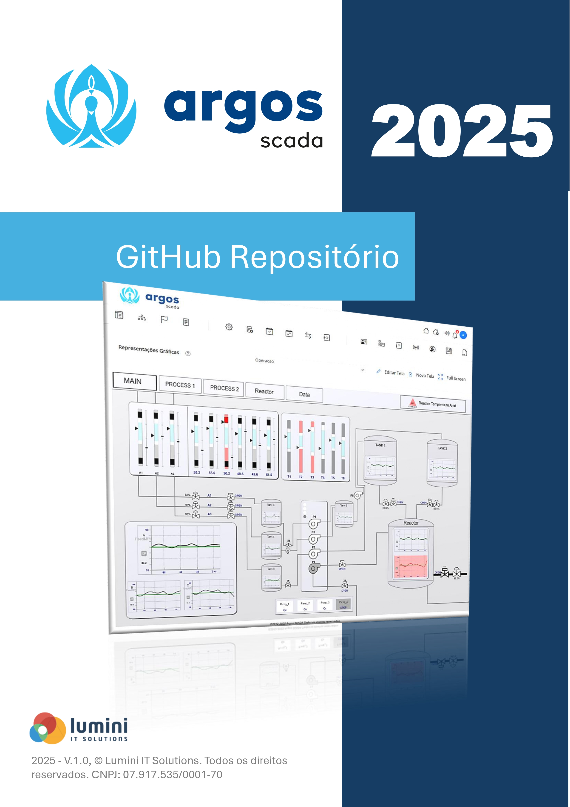

# Argos SCADA
O Argos SCADA é um sistema projetado para sistemas de Supervisão e Aquisição de Dados (SCADA). Ele oferece uma solução robusta e flexível para monitorar e controlar processos industriais, permitindo a integração de diversos dispositivos e protocolos de comunicação. Com uma interface web intuitiva, o Argos Scada facilita a visualização e o gerenciamento de dados em tempo real, tornando-se uma ferramenta essencial para engenheiros e técnicos.

Uma das principais vantagens do Argos SCADA é sua capacidade de personalização. Usuários podem adaptar a plataforma às suas necessidades específicas, criando interfaces Homem-Máquina (HMI) personalizadas, configurando alarmes e relatórios detalhados. Além disso, o suporte a múltiplos protocolos de comunicação garante a compatibilidade com uma ampla gama de equipamentos industriais, desde sensores até controladores lógicos programáveis (CLPs).

  <a href="https://luminiitsolutions.com/">
    
  </a>

